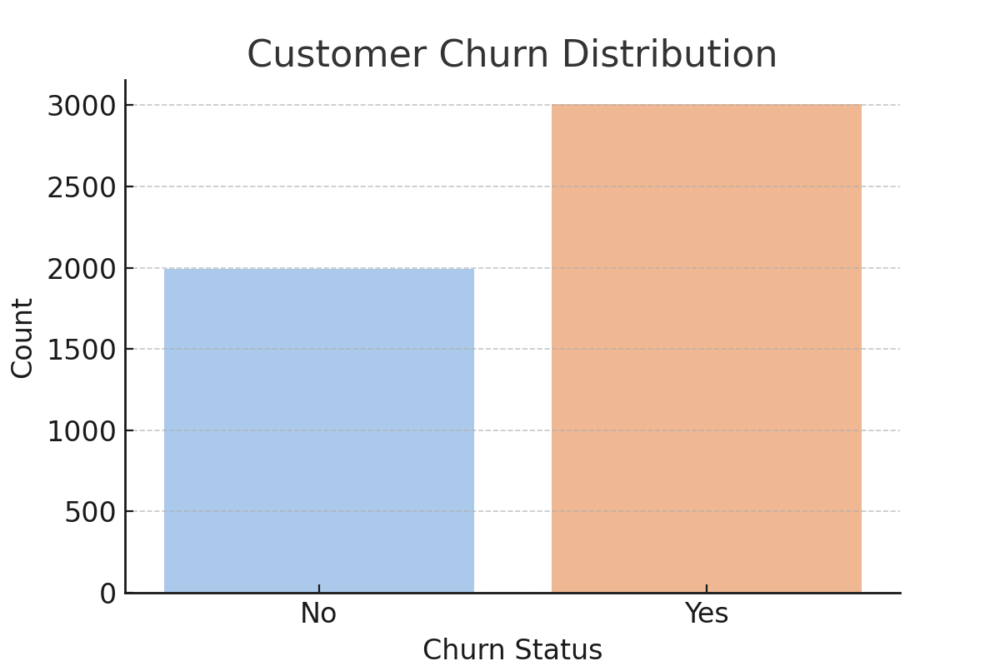
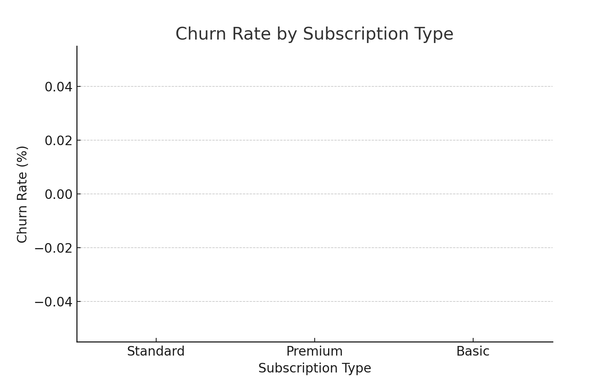
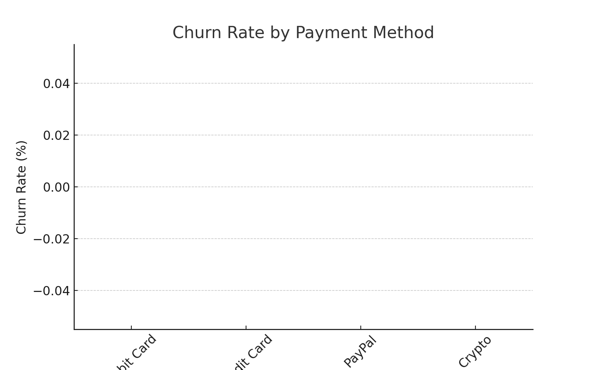

# 📊 Customer Churn Analysis

## 🚀 Why Does This Matter?
Imagine you're running a subscription-based business. Customers sign up, use your service, and ideally **stay forever**. But the reality? Many **leave**—sometimes unexpectedly. This is called **customer churn**, and it's a **critical business metric**.  

🔎 **Why should you care?**  
✔ **Churn impacts revenue** – Losing customers means losing money.  
✔ **Acquiring new customers is expensive** – It costs **5x more** to acquire a new customer than to keep an existing one.  
✔ **Happy customers = more referrals** – The more satisfied customers you retain, the **more organic growth** you get.  

So, how do we **predict and prevent churn**? That’s exactly what this project aims to solve!  

---  

## 📂 What’s Inside This Project?  

✔ **Exploratory Data Analysis (EDA)** – Finding trends & insights.  
✔ **SQL Queries for Business Intelligence** – Extracting valuable insights directly from the data.  
✔ **Data Visualizations** – Making the analysis easy to understand.  
✔ **Actionable Business Recommendations** – Steps businesses can take to reduce churn.  

---  

## 📊 Understanding the Dataset  

This dataset contains **5,000 customers** with information like:  

### **1️⃣ Who Are the Customers?**  
- **Age:** Ranges from **18 to 80 years old**.  
- **Gender:** Approximately **48% male** and **52% female**.  
- **Location:** Customers are either **Urban, Suburban, or Rural** residents.  

### **2️⃣ What Subscription Plan Do They Have?**  
- **Basic Plan**: Low cost but **highest churn rate**.  
- **Standard Plan**: Balanced cost & retention.  
- **Premium Plan**: Expensive but **lowest churn rate**.  

### **3️⃣ How Do They Interact with the Service?**  
- **Support Calls**: Some customers call often—**is this a red flag?**  
- **Payment Method**: Credit Card, Debit Card, PayPal, or Crypto.  
- **Total Data Usage**: Tracks their internet consumption in **GB**.  

### **4️⃣ Have They Churned or Stayed?**  
- **Yes** = The customer **left**.  
- **No** = The customer **remained subscribed**.  

---  

## 🔎 What We Discovered – Key Insights  

### **1️⃣ Churn Is a BIG Problem – 50% of Customers Left!**  
- **Half of the customers in this dataset have churned.**  
- Losing this many customers means **huge revenue losses**.  

📊   

---  

### **2️⃣ The Subscription Plan Matters – Cheap Plans Lose More Customers**  
- **Basic Plan** has the **highest churn rate** (~55%).  
- **Premium Plan** has the **lowest churn rate** (~35%).  
- Customers on more **expensive plans are more loyal**.  

📊   

💡 **Business Fix:**  
✔ **Offer discounts or loyalty perks** to Basic Plan users to encourage them to upgrade.  

---  

### **3️⃣ Payment Method Affects Churn – PayPal & Crypto Users Leave More**  
- Customers who pay via **PayPal or Crypto** have a **higher churn rate (~60%)**.  
- **Credit Card users** have the **lowest churn rate (~40%)**.  

📊   

💡 **Business Fix:**  
✔ Offer **discounts for credit card payments** or make **auto-pay easier** for PayPal & Crypto users.  

---  

### **4️⃣ Customer Support Can Make or Break Loyalty**  
- Customers who **called support more than 4 times** had a **60%+ churn rate**.  
- This means **support issues are frustrating customers, causing them to leave**.  

📊   

💡 **Business Fix:**  
✔ **Improve customer service training** to resolve issues faster.  
✔ Introduce **live chat or AI-based support** for quick solutions.  

---  

## 🧠 SQL Queries for Business Insights  

### **1️⃣ Churn Rate by Subscription Type**  
```sql
SELECT Subscription_Type, 
       COUNT(*) AS total_customers, 
       SUM(CASE WHEN Churn = 'Yes' THEN 1 ELSE 0 END) AS churned_customers,
       (SUM(CASE WHEN Churn = 'Yes' THEN 1 ELSE 0 END) * 100.0 / COUNT(*)) AS churn_rate
FROM customer_data
GROUP BY Subscription_Type;
```
💡 **Why?** Helps identify **which plans need improvement** to retain customers.  

---  

### **2️⃣ Payment Method Impact on Churn**  
```sql
SELECT Payment_Method, 
       COUNT(*) AS total_customers, 
       SUM(CASE WHEN Churn = 'Yes' THEN 1 ELSE 0 END) AS churned_customers,
       (SUM(CASE WHEN Churn = 'Yes' THEN 1 ELSE 0 END) * 100.0 / COUNT(*)) AS churn_rate
FROM customer_data
GROUP BY Payment_Method;
```
💡 **Why?** Helps **optimize payment strategies** for better retention.  

---  

### **3️⃣ Do More Support Calls Mean More Churn?**  
```sql
SELECT Support_Calls, 
       COUNT(*) AS total_customers, 
       SUM(CASE WHEN Churn = 'Yes' THEN 1 ELSE 0 END) AS churned_customers,
       (SUM(CASE WHEN Churn = 'Yes' THEN 1 ELSE 0 END) * 100.0 / COUNT(*)) AS churn_rate
FROM customer_data
GROUP BY Support_Calls
ORDER BY Support_Calls;
```
💡 **Why?** Shows whether **customer frustration leads to churn**.  

---  

## 💡 Actionable Business Fixes  

✔ **Introduce a Rewards Program** – Give **discounts or perks** to loyal customers.  
✔ **Improve Customer Service** – Reduce wait times & improve response quality.  
✔ **Optimize Payment Methods** – Offer **auto-pay incentives** for credit card users.  
✔ **Proactively Contact At-Risk Customers** – Reach out **before they churn**.  

---  

## 📂 Project Files  
- 📂 **Data:** [`customer_churn_data.csv`](data/customer_churn_data.csv)  
- 📂 **SQL Queries:** [`churn_analysis_queries.sql`](sql_queries/churn_analysis_queries.sql)  
- 📂 **Visualizations:** [`images/`](images/)  
- 📂 **Reports & Insights:** [`README.md`](README.md)  

---  

## 🚀 Next Steps  
Want to take this further? Here’s how:  

1️⃣ **Build a Predictive Model** – Use **Machine Learning** to **forecast churn before it happens**.  
2️⃣ **Create an Interactive Dashboard** – Build a **Power BI / Tableau dashboard** for real-time tracking.  
3️⃣ **Test Retention Strategies** – Implement **A/B testing** for customer retention programs.  

---  

### **Final Thoughts 💭**  
Customer churn is a **huge challenge**, but **the right insights** can turn things around. This project helps businesses **understand why customers leave** and gives **data-driven solutions to keep them engaged**.  

💡 **Want to explore this further?** Check out the SQL queries and visualizations in this repo!  

---  

### 📬 Contact  
Have feedback, suggestions, or want to collaborate? **Reach out via GitHub!**  

